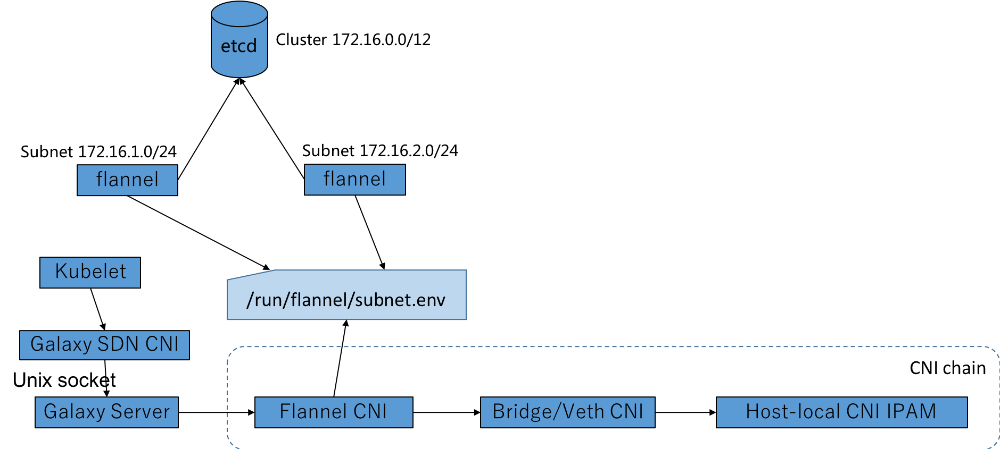

# Galaxy Configuration

## Default network and Supported networks

You may edit galaxy-etc ConfigMap in galaxy.yaml to update DefaultNetworks and NetworkConf for all supported networks.

Galaxy support multiple default networks and configures them according to the order of configured `DefaultNetworks`.

```
{
  "NetworkConf":[
    {"type":"tke-route-eni","eni":"eth1","routeTable":1},
    {"type":"galaxy-flannel", "delegate":{"type":"galaxy-veth"}, "subnetFile":"/run/flannel/subnet.env"},
    {"type":"galaxy-k8s-vlan", "device":"eth1", "default_bridge_name": "br0"},
    {"type": "galaxy-k8s-sriov", "device": "eth1", "vf_num": 10}
  ],
  "DefaultNetworks": ["galaxy-flannel"]
}
```

## Configure specific networks for a POD

Galaxy support to configure specific and multiple networks for a single POD.

Pod Annotation | Usage | Expain
---------------|-------|--------
k8s.v1.cni.cncf.io/networks | k8s.v1.cni.cncf.io/networks: galaxy-flannel,galaxy-k8s-sriov | Galaxy setup specified networks according to the order of its value if not empty for a POD, otherwise make use of `DefaultNetworks` to do that. Be sure all networks have a configuration within `NetworkConf` of galaxy-etc ConfigMap.

## Galaxy command line args

```
Usage of bin/galaxy:
      --alsologtostderr                   log to standard error as well as files
      --bridge-nf-call-iptables           Ensure bridge-nf-call-iptables is set/unset (default true)
      --flannel-allocated-ip-dir string   IP storage directory of flannel cni plugin (default "/var/lib/cni/networks")
      --flannel-gc-interval duration      Interval of executing flannel network gc (default 10s)
      --gc-dirs string                    Comma separated configure storage directory of cni plugin, the file names in this directory are container ids (default "/var/lib/cni/flannel,/var/lib/cni/galaxy,/var/lib/cni/galaxy/port")
      --hostname-override string          kubelet hostname override, if set, galaxy use this as node name to get node from apiserver
      --ip-forward                        Ensure ip-forward is set/unset (default true)
      --json-config-path string           The json config file location of galaxy (default "/etc/galaxy/galaxy.json")
      --kubeconfig string                 The kube config file location of APISwitch, used to support TLS
      --log-backtrace-at traceLocation    when logging hits line file:N, emit a stack trace (default :0)
      --log-dir string                    If non-empty, write log files in this directory
      --log-flush-frequency duration      Maximum number of seconds between log flushes (default 5s)
      --logtostderr                       log to standard error instead of files (default true)
      --master string                     The address and port of the Kubernetes API server
      --network-policy                    Enable network policy function
      --route-eni                         Ensure route-eni is set/unset
      --stderrthreshold severity          logs at or above this threshold go to stderr (default 2)
  -v, --v Level                           log level for V logs
      --version version[=true]            Print version information and quit
      --vmodule moduleSpec                comma-separated list of pattern=N settings for file-filtered logging
```

# How Galaxy works



This is how Galaxy supports running [flannel](https://github.com/coreos/flannel) network.

1. Flannel on each Kubelet allocates a subnet and saves it on etcd and local disk (/run/flannel/subnet.env)
1. Kubelet launches SDN CNI process according to [CNI configuration](../yaml/galaxy.yaml).
1. SDN CNI process calls Galaxy via unix socket with all args from Kubelet.
1. Galaxy calls Flannel CNI to parse subnet infos from /run/flannel/subnet.env.
1. Flannel CNI calls either Bridge CNI or Veth CNI to configure networks for PODs.