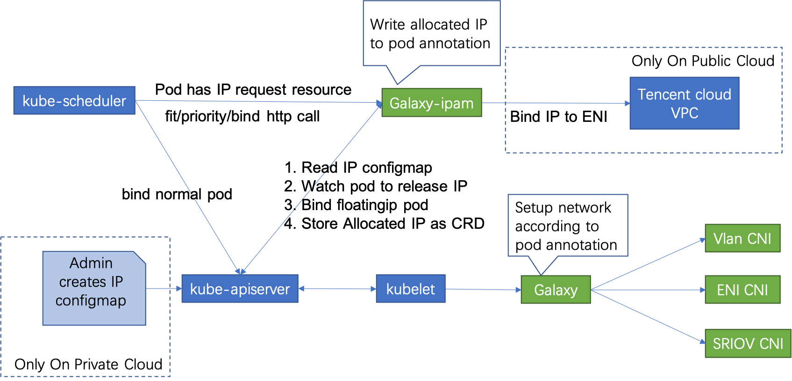

# Galaxy-ipam Configuration

Galaxy-ipam is a [Kubernetes Scheudler Extender](https://kubernetes.io/docs/concepts/extend-kubernetes/extend-cluster/#scheduler-extensions).
Scheduler calls Galaxy-ipam on filter/priority/bind calls via HTTP, so we need to create a scheduler policy configuration.

## Kubernetes Scheduler Configuration

Because of [https://github.com/kubernetes/kubernetes/pull/59363](https://github.com/kubernetes/kubernetes/pull/59363) (released in 1.10),
we don't need to configure predicates/priorities in policy config, scheduler applies built-in default sets of predicate/prioritizer on pod scheduling.

```
# Creating scheduler Policy ConfigMap
cat <<EOF | kubectl create -f -
apiVersion: v1
kind: ConfigMap
metadata:
  name: scheduler-policy
  namespace: kube-system
data:
  policy.cfg: |
    {
      "kind": "Policy",
      "apiVersion": "v1",
      "extenders": [
        {
          "urlPrefix": "http://127.0.0.1:9040/v1",
          "httpTimeout": 10000000000,
          "filterVerb": "filter",
          "prioritizeVerb": "prioritize",
          "BindVerb": "bind",
          "weight": 1,
          "enableHttps": false,
          "managedResources": [
            {
              "name": "tke.cloud.tencent.com/eni-ip",
              "ignoredByScheduler": false
            }
          ]
        }
      ]
    }
EOF

# Add the following config to kube-scheduler and restart it
--policy-configmap=scheduler-policy
```

Note:
If you want to limit each node's max Float IPs, please set ignoredByScheduler to false, then the Float IP resource will be judge by scheduler's PodFitsResource algorithm.

## Galaxy-ipam Configuration

Galaxy uses MySQL or CRD to persist allocated IPs. Please update galaxy-ipam-etc ConfigMap to replace MySQL address, username and password.

```
  galaxy-ipam.json: |
    {
      "schedule_plugin": {
        "database": {
          "protocol": "tcp",
          "addr": "127.0.0.1:3306",
          "username": "***",
          "password": "***",
          "driver": "mysql",
          "name": "test",
          "maxConn": 10000
        },
        "cloudProviderGrpcAddr": "127.0.0.2:80"
      }
    }
```

## Float IP Configuration

If running on bare metal environment, please create a ConfigMap floatingip-config.

```
kind: ConfigMap
apiVersion: v1
metadata:
 name: floatingip-config
 namespace: kube-system
data:
 floatingips: '[{"routableSubnet":"10.0.0.0/16","ips":["10.0.70.2~10.0.70.241"],"subnet":"10.0.70.0/24","gateway":"10.0.70.1"}]'
```

- routableSubnet: the node CIDR.
- ips: available POD ips, be sure these IPs are reachable within the node CIDR.
- subnet: the POD IP subnet.
- vlan: the POD IP vlan id. If POD IPs are not belongs to the same vlan as node IP, please specify the POD IP vlan ids. Leave it empty if not required.

## CNI network configuration

You can use [Vlan CNI or TKE route ENI CNI plugin](supported-cnis.md) to launch Float IP Pods. Make sure to update `DefaultNetworks` to `galaxy-k8s-vlan` of galaxy-etc ConfigMap or add `k8s.v1.cni.cncf.io/networks=galaxy-k8s-vlan` annotation to Pod spec.

## Cloud Provider

If running on Public or Private Clouds, Galaxy can leverage ENI function to provide Float IPs for PODs.
Please update `cloudProviderGrpcAddr` in galaxy-ipam-etc ConfigMap.

Cloud provider is responsible for

1. Creating and binding ENI for each kubelet node
1. Provide Float IP configuration for Galaxy-ipam
1. Implement a GRPC server based on the [ip_provider.proto](../pkg/ipam/cloudprovider/rpc/ip_provider.proto)
1. Update Node status to add [Float IP extend resource](float-ip.md) numbers if requiring to limit each node's max Float IPs.

# How Galaxy-ipam works



This is how Galaxy-ipam supports running Underlay network.

1. On private cloud the cluster administrator needs to config the floatingip-config ConfigMap. While on public cloud Cloud
provider should provide that for Galaxy-ipam
1. Kubernetes scheduler calls Galaxy-ipam on filter/priority/bind method
1. Galaxy-ipam checks if POD has a reserved IP, if it does, Galaxy-ipam marks only the nodes within the available subnets of this IP as
valid node, otherwise all nodes that has Float IP left. During binding, Galaxy-ipam allocates an IP and writes it into POD annotation.
1. On public cloud, scheduler plugin calls Cloud provider to Assign and UnAssign ENI IP.
1. Galaxy gets IP from POD annotation and calls CNIs with them as CNI args.
